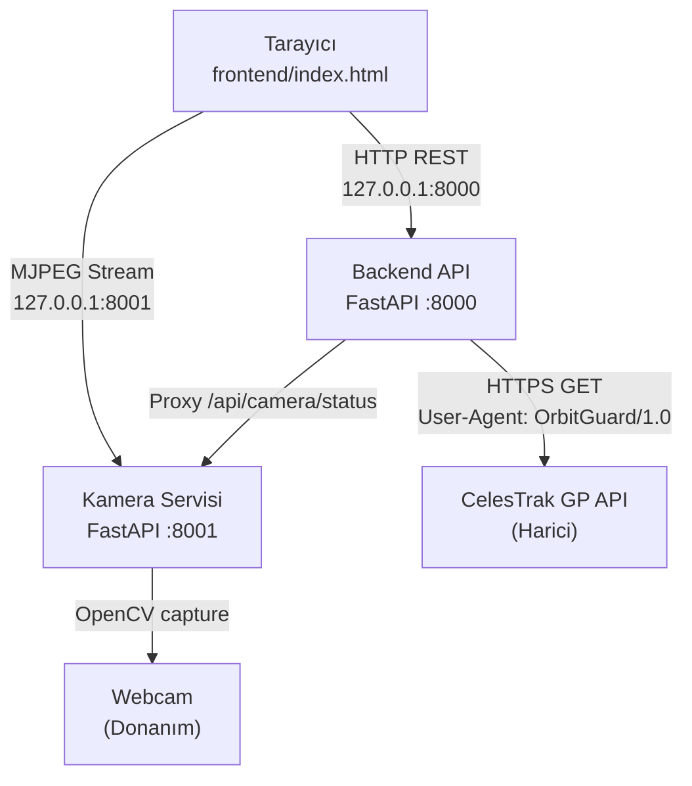
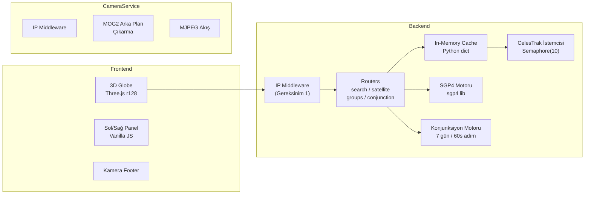

# OrbitGuard — Tasarım Belgesi

## Genel Bakış

OrbitGuard, Türk uydularını (Türksat 4A/4B/5A/5B ve Göktürk 1/2) gerçek zamanlı olarak izleyen, yaklaşan uzay çöpü ile çarpışma riskini hesaplayan ve sonuçları 3D globe üzerinde görselleştiren bir uzay takip uygulamasıdır. Sistem aynı zamanda webcam tabanlı gökyüzü geçiş algılama özelliği sunar.

Sistem üç bağımsız süreçten oluşur:

- **Backend API** — Python/FastAPI, port 8000, yalnızca 127.0.0.1
- **Kamera Servisi** — Python/FastAPI, port 8001, yalnızca 127.0.0.1
- **Frontend** — Tek HTML dosyası, Three.js r128 CDN + Vanilla JS

Tüm servisler yalnızca localhost üzerinden erişilebilir; dış ağ erişimi middleware katmanında engellenir.

---

## Mimari

### Genel Mimari Diyagramı



### Katman Mimarisi



### Veri Akışı

1. Frontend 30 saniyede bir `/api/satellite/{catnr}/position` endpoint'lerini çağırır.
2. Backend önce in-memory cache'i kontrol eder; TTL dolmuşsa CelesTrak'tan TLE çeker.
3. SGP4 motoru TLE'den ECI → Geodetik dönüşümü yapar.
4. Konjunksiyon motoru 7 günlük propagasyon + inklinasyon filtresi + miss distance hesabı yapar.
5. Frontend sonuçları Three.js sahnesine yansıtır.

---

## Bileşenler ve Arayüzler

### Backend Bileşenleri

#### `middleware.py` — IP Erişim Kontrolü

```python
class LocalOnlyMiddleware(BaseHTTPMiddleware):
    async def dispatch(self, request: Request, call_next) -> Response:
        # client.host 127.0.0.1 veya ::1 değilse → 403
```

Her istekte ilk çalışan katman. Router'lara ulaşmadan önce IP doğrulaması tamamlanır.

#### `celestrak_client.py` — CelesTrak İstemcisi

| Metot | Açıklama |
|---|---|
| `fetch_group(group, limit)` | Grup TLE verisi çeker, Semaphore(10) ile sınırlanır |
| `fetch_by_catnr(catnr)` | Tekil uydu TLE verisi çeker |
| `fetch_by_name(query)` | İsme göre arama yapar |
| `health_check()` | CelesTrak erişilebilirliğini test eder |

- `User-Agent: OrbitGuard/1.0` tüm isteklere eklenir.
- `asyncio.Semaphore(10)` ile dakikada en fazla 10 eş zamanlı istek.
- 90 saniyelik timeout; aşılırsa `TimeoutError` fırlatılır.

#### `sgp4_engine.py` — SGP4 Motoru

| Metot | Açıklama |
|---|---|
| `propagate(tle_line1, tle_line2, dt)` | ECI koordinatları + hız vektörü döndürür |
| `eci_to_geodetic(x, y, z, dt)` | ECI → (lat, lon, alt_km) dönüşümü |
| `orbital_elements(tle_line1, tle_line2)` | Perigee, apogee, periyot, inklinasyon |

#### `conjunction.py` — Konjunksiyon Motoru

| Metot | Açıklama |
|---|---|
| `analyze_turkish_satellites(debris_tles)` | 6 Türk uydusu × debris listesi, 7 gün |
| `analyze_pair(tle1, tle2, days)` | İki uydu arası konjunksiyon analizi |
| `_inclination_filter(sat1, sat2)` | İnklinasyon farkı > 5° → elenecek |
| `_compute_miss_distance(pos1, pos2)` | ECI vektörleri arası Öklid mesafesi |

#### Routers

| Router | Prefix | Sorumluluk |
|---|---|---|
| `search.py` | `/api/search` | İsim ve NORAD_ID araması |
| `satellite.py` | `/api/satellite` | Tekil uydu bilgisi, konum, yörünge |
| `groups.py` | `/api/groups` | Grup TLE listesi ve sayım |
| `conjunction.py` | `/api/conjunction` | Türk uyduları ve çift analizi |

#### `main.py` — Uygulama Giriş Noktası

- `LocalOnlyMiddleware` kaydı
- Router'ların dahil edilmesi
- `GET /` ve `GET /health` endpoint'leri
- Uvicorn başlatma: `host="127.0.0.1"`, `port=8000`

### Kamera Servisi Bileşenleri (`camera_service.py`)

| Endpoint | Metot | Açıklama |
|---|---|---|
| `/camera/start` | POST | Webcam akışını başlatır, MOG2 etkinleştirir |
| `/camera/stop` | POST | Akışı durdurur, kaynakları serbest bırakır |
| `/camera/stream` | GET | MJPEG akışı (`multipart/x-mixed-replace`) |
| `/camera/status` | GET | Aktif/pasif durum + Ankara koordinatları |
| `/camera/detections` | GET | Algılanan hareketli nesneler + zaman damgası |

- `LocalOnlyMiddleware` aynı şekilde uygulanır.
- Varsayılan gözlemci konumu: Ankara (39.9°N, 32.8°E, 938m).
- MOG2 parametreleri: `history=500`, `varThreshold=16`, `detectShadows=True`.

### Frontend Bileşenleri (`frontend/index.html`)

| Bileşen | Açıklama |
|---|---|
| `GlobeRenderer` | Three.js r128 ile 3D dünya küresi, uydu noktaları |
| `SatellitePanel` | Sol panel: Türk uyduları listesi, GEO/LEO filtresi |
| `RiskDashboard` | Sağ panel: Konjunksiyon riskleri, önem sırası |
| `DetailView` | Seçili uydu detay bilgileri |
| `CameraFooter` | MJPEG akışı + kamera durum göstergesi |
| `APIClient` | `fetch()` tabanlı Backend istek yöneticisi |

- Tüm stiller `<style>` bloğunda inline.
- Tüm JS `<script>` bloğunda inline.
- Three.js: `https://cdnjs.cloudflare.com/ajax/libs/three.js/r128/three.min.js`
- Backend base URL: `http://127.0.0.1:8000`

---

## Veri Modelleri

### TLE Önbellek Girişi

```python
@dataclass
class CacheEntry:
    data: Any           # Ham TLE verisi (dict veya list)
    fetched_at: float   # time.time() zaman damgası
    ttl_seconds: int    # Grup: 900s (15dk), Tekil: 300s (5dk)

    @property
    def is_expired(self) -> bool:
        return time.time() - self.fetched_at > self.ttl_seconds
```

### Uydu Konum Yanıtı

```python
{
    "eci": {"x": float, "y": float, "z": float},          # km
    "geodetic": {"lat": float, "lon": float, "alt_km": float},
    "velocity": {"vx": float, "vy": float, "vz": float}   # km/s
}
```

### Uydu Bilgi Yanıtı

```python
{
    "name": str,
    "norad_id": int,
    "epoch": str,           # ISO 8601
    "inclination": float,   # derece
    "eccentricity": float,
    "altitude_km": float,
    "period_min": float,
    "orbit_type": str,      # "GEO" | "LEO" | "MEO" | "OTHER"
    "tle_line1": str,
    "tle_line2": str
}
```

### Yörünge Parametreleri Yanıtı

```python
{
    "perigee_km": float,
    "apogee_km": float,
    "period_min": float,
    "inclination_deg": float,
    "orbit_type": str
}
```

### Konjunksiyon Olayı

```python
{
    "sat1_norad": int,
    "sat2_norad": int,
    "sat1_name": str,
    "sat2_name": str,
    "tca": str,             # Time of Closest Approach, ISO 8601
    "miss_distance_km": float,
    "risk_level": str       # "LOW" | "MEDIUM" | "HIGH" | "CRITICAL"
}
```

### Kamera Durum Yanıtı

```python
{
    "active": bool,
    "observer": {
        "name": "Ankara",
        "lat": 39.9,
        "lon": 32.8,
        "alt_m": 938
    },
    "detections_count": int
}
```

### Türk Uyduları Sabit Listesi

```python
TURKISH_SATELLITES = [
    {"name": "TURKSAT 4A", "norad_id": 39522, "orbit": "GEO"},
    {"name": "TURKSAT 4B", "norad_id": 40984, "orbit": "GEO"},
    {"name": "TURKSAT 5A", "norad_id": 47720, "orbit": "GEO"},
    {"name": "TURKSAT 5B", "norad_id": 49336, "orbit": "GEO"},
    {"name": "GOKTURK-1",  "norad_id": 41785, "orbit": "LEO"},
    {"name": "GOKTURK-2",  "norad_id": 40895, "orbit": "LEO"},
]
```

### Sağlık Kontrolü Yanıtı

```python
{
    "status": "ok",
    "celestrak_ok": bool,
    "timestamp": str    # ISO 8601
}
```

---

## Doğruluk Özellikleri (Correctness Properties)

*Bir özellik (property), sistemin tüm geçerli çalışmalarında doğru olması gereken bir karakteristik veya davranıştır — temelde sistemin ne yapması gerektiğine dair biçimsel bir ifadedir. Özellikler, insan tarafından okunabilir spesifikasyonlar ile makine tarafından doğrulanabilir doğruluk garantileri arasındaki köprüyü oluşturur.*

---

### Özellik 1: IP Filtresi — Her İki Servis

*Herhangi bir* HTTP isteği için: kaynak IP 127.0.0.1 veya ::1 ise istek işleme alınmalı (HTTP 2xx/4xx/5xx, 403 hariç); kaynak IP başka herhangi bir değerse hem Backend hem Kamera Servisi HTTP 403 Forbidden döndürmelidir.

**Doğrular: Gereksinim 1.2, 1.3, 1.4, 1.5**

---

### Özellik 2: User-Agent Başlığı Zorunluluğu

*Herhangi bir* CelesTrak GP API çağrısı için, gönderilen HTTP isteğinin `User-Agent` başlığı tam olarak `OrbitGuard/1.0` değerini içermelidir.

**Doğrular: Gereksinim 2.1**

---

### Özellik 3: Eş Zamanlı İstek Sınırı

*Herhangi bir* anda CelesTrak GP API'sine gönderilen eş zamanlı istek sayısı 10'u geçmemelidir.

**Doğrular: Gereksinim 2.2**

---

### Özellik 4: Önbellek TTL Doğruluğu

*Herhangi bir* grup veya tekil uydu sorgusu için: TTL süresi dolmadan yapılan ikinci istek CelesTrak'a gitmeden önbellekten yanıt almalı; TTL süresi dolduktan sonra yapılan istek CelesTrak'tan taze veri çekmelidir. (Grup TTL: 900s, Tekil TTL: 300s)

**Doğrular: Gereksinim 3.1, 3.2, 3.3, 3.4**

---

### Özellik 5: Sağlık Endpoint Şeması

*Herhangi bir* CelesTrak erişilebilirlik durumunda `GET /health` yanıtı `status`, `celestrak_ok` (bool) ve `timestamp` (ISO 8601) alanlarını içermelidir; `celestrak_ok` değeri CelesTrak'ın gerçek erişilebilirlik durumunu yansıtmalıdır.

**Doğrular: Gereksinim 4.2, 4.3, 4.4**

---

### Özellik 6: İsim Araması Tutarlılığı

*Herhangi bir* arama sorgusu `q` için, `GET /api/search/name?q=<q>` endpoint'inden dönen tüm uyduların `name` alanı (büyük/küçük harf duyarsız) `q` dizesini içermelidir.

**Doğrular: Gereksinim 5.1**

---

### Özellik 7: NORAD_ID Araması Doğruluğu

*Herhangi bir* geçerli NORAD_ID için, `GET /api/search/catnr?id=<norad_id>` endpoint'inden dönen verinin `norad_id` alanı sorgulanan değerle eşleşmelidir.

**Doğrular: Gereksinim 5.2**

---

### Özellik 8: Geçersiz Parametre → 400

*Herhangi bir* eksik veya geçersiz arama parametresi için Backend HTTP 400 döndürmelidir.

**Doğrular: Gereksinim 5.4**

---

### Özellik 9: Uydu Endpoint Şema Bütünlüğü

*Herhangi bir* geçerli `catnr` için:
- `GET /api/satellite/{catnr}` yanıtı: `name`, `norad_id`, `epoch`, `inclination`, `eccentricity`, `altitude_km`, `period_min`, `orbit_type`, `tle_line1`, `tle_line2` alanlarını içermelidir.
- `GET /api/satellite/{catnr}/position` yanıtı: `eci.{x,y,z}`, `geodetic.{lat,lon,alt_km}`, `velocity.{vx,vy,vz}` alanlarını içermelidir.
- `GET /api/satellite/{catnr}/orbital` yanıtı: `perigee_km`, `apogee_km`, `period_min`, `inclination_deg`, `orbit_type` alanlarını içermelidir.

**Doğrular: Gereksinim 6.1, 6.2, 6.3**

---

### Özellik 10: Grup Limit Sınırı

*Herhangi bir* grup sorgusu için `GET /api/groups/{group}?limit=500` endpoint'inden dönen kayıt sayısı 500'ü geçmemelidir.

**Doğrular: Gereksinim 7.1**

---

### Özellik 11: SGP4 Çıktı Şeması ve Koordinat Geçerliliği

*Herhangi bir* geçerli TLE çifti için SGP4 motoru:
- ECI koordinatları (x, y, z km) ve hız vektörü (vx, vy, vz km/s) döndürmelidir.
- Geodetik dönüşüm sonucu: enlem ∈ [-90, 90], boylam ∈ [-180, 180], irtifa ≥ 0 olmalıdır.

**Doğrular: Gereksinim 8.1, 8.2, 8.3**

---

### Özellik 12: Geçersiz TLE → Hata

*Herhangi bir* bozuk veya geçersiz TLE verisi için SGP4 motoru hesaplama hatası bildirmelidir (exception veya hata yanıtı).

**Doğrular: Gereksinim 8.4**

---

### Özellik 13: İnklinasyon Filtresi Doğruluğu

*Herhangi bir* iki uydu çifti için inklinasyon farkı 5 dereceden büyükse, bu çift konjunksiyon analizi sonuçlarında yer almamalıdır.

**Doğrular: Gereksinim 9.2**

---

### Özellik 14: Konjunksiyon Olayı Miss Distance Alanı

*Herhangi bir* konjunksiyon analizi sonucunda dönen her olay `miss_distance_km` alanını içermeli ve bu değer ≥ 0 olmalıdır.

**Doğrular: Gereksinim 9.3**

---

### Özellik 15: MOG2 Hareket Algılama

*Herhangi bir* webcam karesi için MOG2 algoritması: hareketsiz arka plan karelerinde algılama yapmamalı, belirgin hareket içeren karelerde en az bir nesne algılamalıdır.

**Doğrular: Gereksinim 10.1**

---

### Özellik 16: Kamera Start/Stop Round-Trip

*Herhangi bir* kamera durumu için: `POST /camera/start` sonrası `GET /camera/status` `active: true` döndürmeli; ardından `POST /camera/stop` sonrası `active: false` döndürmelidir.

**Doğrular: Gereksinim 10.2, 10.3**

---

### Özellik 17: Kamera Durum Şeması ve Ankara Koordinatları

*Herhangi bir* kamera durumunda `GET /camera/status` yanıtı `active` (bool) ve `observer` alanlarını içermeli; `observer.lat` ≈ 39.9, `observer.lon` ≈ 32.8, `observer.alt_m` ≈ 938 olmalıdır.

**Doğrular: Gereksinim 10.5**

---

### Özellik 18: Detection Zaman Damgası Zorunluluğu

*Herhangi bir* algılama olayı için `GET /camera/detections` yanıtındaki her detection nesnesi `timestamp` alanını içermelidir.

**Doğrular: Gereksinim 10.6**

---

### Özellik 19: Risk Sıralama Tutarlılığı

*Herhangi bir* konjunksiyon listesi için risk dashboard'unda gösterilen olaylar risk seviyesine göre azalan sırada (CRITICAL > HIGH > MEDIUM > LOW) sıralanmış olmalıdır.

**Doğrular: Gereksinim 13.2**

---

### Özellik 20: Frontend API Base URL Tutarlılığı

*Herhangi bir* Backend API çağrısı için Frontend'in gönderdiği istek URL'si `http://127.0.0.1:8000` ile başlamalıdır.

**Doğrular: Gereksinim 14.4**

---

## Hata Yönetimi

### Backend Hata Stratejisi

| Durum | HTTP Kodu | Yanıt |
|---|---|---|
| Yetkisiz IP | 403 | `{"detail": "Forbidden"}` |
| Eksik/geçersiz parametre | 400 | `{"detail": "<açıklama>"}` |
| Kaynak bulunamadı | 404 | `{"detail": "Not found"}` |
| CelesTrak erişilemez | 503 | `{"detail": "Upstream unavailable"}` |
| Kamera Servisi erişilemez | 503 | `{"detail": "Camera service unavailable"}` |
| SGP4 hesaplama hatası | 422 | `{"detail": "Propagation error: <mesaj>"}` |
| Beklenmeyen hata | 500 | `{"detail": "Internal server error"}` |

### CelesTrak İstemcisi Hata Yönetimi

```
CelesTrak isteği
    ├── Semaphore acquire (max 10 eş zamanlı)
    ├── HTTP GET (timeout=90s)
    │   ├── Başarı → veriyi döndür
    │   ├── Timeout → TimeoutError fırlat, logla
    │   └── Bağlantı hatası → ConnectionError fırlat, logla
    └── Semaphore release
```

### SGP4 Hata Yönetimi

- Geçersiz TLE formatı → `ValueError` ile açıklayıcı mesaj
- SGP4 propagasyon hatası (örn. decay) → `PropagationError` özel exception
- ECI→Geodetik dönüşüm hatası → `CoordinateError`

### Kamera Servisi Hata Yönetimi

- Webcam açılamıyor → `GET /camera/status` içinde `active: false`, `error` alanı
- MOG2 frame işleme hatası → loglama, akış devam eder
- `POST /camera/start` webcam yokken → HTTP 503

### Frontend Hata Yönetimi

- Backend erişilemez → kullanıcıya bağlantı hatası bildirimi, 30s sonra yeniden dene
- Konum verisi alınamıyor → son bilinen konum gösterilir, "stale" etiketi eklenir
- Kamera akışı kesilirse → footer'da "Kamera bağlantısı kesildi" mesajı

---

## Test Stratejisi

### Genel Yaklaşım

Test stratejisi iki tamamlayıcı katmandan oluşur:

- **Birim testleri**: Belirli örnekler, edge case'ler ve hata koşulları
- **Özellik tabanlı testler (PBT)**: Tüm girdiler üzerinde evrensel özelliklerin doğrulanması

Her iki test türü de kapsamlı kapsam için gereklidir: birim testleri somut hataları yakalar, özellik testleri genel doğruluğu doğrular.

### Özellik Tabanlı Test Kütüphanesi

Python için **Hypothesis** kütüphanesi kullanılacaktır.

```bash
pip install hypothesis pytest pytest-asyncio httpx
```

### Özellik Testi Konfigürasyonu

Her özellik testi minimum **100 iterasyon** çalıştırılacak şekilde yapılandırılmalıdır:

```python
from hypothesis import given, settings, strategies as st

@settings(max_examples=100)
@given(...)
def test_property_name(...):
    # Feature: orbitguard, Property N: <özellik metni>
    ...
```

Her test, ilgili tasarım özelliğine referans veren bir yorum içermelidir:
`# Feature: orbitguard, Property <N>: <özellik metni>`

### Özellik Testleri

Her Correctness Property için tek bir özellik tabanlı test yazılacaktır:

| Özellik | Test Açıklaması | Strateji |
|---|---|---|
| P1: IP Filtresi | Rastgele IP → 403 veya geçer | `st.ip_addresses()` |
| P2: User-Agent | Her CelesTrak isteğinde başlık kontrolü | Mock HTTP client |
| P3: Eş Zamanlı Limit | N>10 eş zamanlı istek → max 10 aktif | `asyncio` + mock |
| P4: Cache TTL | Zaman manipülasyonu ile hit/miss | `st.floats(0, 1800)` |
| P5: Health Şeması | CelesTrak durumu → celestrak_ok korelasyonu | Mock CelesTrak |
| P6: İsim Araması | Rastgele sorgu → tüm sonuçlar içeriyor | `st.text()` |
| P7: NORAD Araması | Rastgele NORAD_ID → dönen ID eşleşiyor | `st.integers(1, 99999)` |
| P8: Geçersiz Param → 400 | Eksik parametre → 400 | `st.none()` |
| P9: Uydu Şema | Rastgele catnr → tüm alanlar mevcut | `st.integers()` |
| P10: Grup Limit | Herhangi grup → ≤500 kayıt | Mock CelesTrak |
| P11: SGP4 Şema | Rastgele geçerli TLE → koordinat geçerliliği | TLE generator |
| P12: Geçersiz TLE | Bozuk TLE → exception | `st.text()` |
| P13: İnklinasyon Filtresi | Fark>5° → sonuçta yok | `st.floats()` |
| P14: Miss Distance | Her olay → miss_distance_km ≥ 0 | Mock propagasyon |
| P15: MOG2 Algılama | Hareketsiz frame → 0 algılama | Mock OpenCV frame |
| P16: Start/Stop | Start→active:true, Stop→active:false | Mock webcam |
| P17: Kamera Şema | Status → Ankara koordinatları | Mock kamera |
| P18: Detection Timestamp | Her detection → timestamp mevcut | Mock MOG2 |
| P19: Risk Sıralama | Rastgele risk listesi → azalan sıra | `st.lists()` |
| P20: API Base URL | Tüm fetch çağrıları → 127.0.0.1:8000 | JS DOM analizi |

### Birim Testleri

Birim testleri belirli örneklere ve edge case'lere odaklanır:

**Backend:**
- `GET /` → `{"status": "ok", "version": "1.0"}` (Gereksinim 4.1)
- Boş arama sonucu → `[]` (Gereksinim 5.3)
- Var olmayan catnr → 404 (Gereksinim 6.4)
- Geçersiz grup → 404 (Gereksinim 7.3)
- Var olmayan NORAD_ID konjunksiyon → 404 (Gereksinim 9.5)
- CelesTrak timeout → TimeoutError (Gereksinim 2.3)
- CelesTrak erişilemez → hata bildirimi (Gereksinim 2.4)
- Kamera Servisi erişilemez → 503 (Gereksinim 11.2)
- Konjunksiyon pair endpoint şeması (Gereksinim 9.4)
- 7 günlük propagasyon 6 Türk uydusu kapsamı (Gereksinim 9.1)

**Kamera Servisi:**
- `POST /camera/start` → `active: true` (Gereksinim 10.2)
- `GET /camera/stream` → `Content-Type: multipart/x-mixed-replace` (Gereksinim 10.4)
- Proxy endpoint doğrulaması (Gereksinim 11.1)

**Frontend:**
- 6 Türk uydusu sol panelde listeleniyor (Gereksinim 13.1)
- Uydu seçimi → detay paneli güncelleniyor (Gereksinim 13.3)
- Footer kamera elementleri mevcut (Gereksinim 13.4)
- Arka plan rengi `#0a0a0f` (Gereksinim 13.5)
- Tek dosya mimarisi — harici CSS/JS yok (Gereksinim 14.1, 14.3)
- Three.js CDN URL'si r128 içeriyor (Gereksinim 14.2)
- 30s polling interval (Gereksinim 12.3)
- `run.sh` ve `run.bat` dosyaları mevcut (Gereksinim 15.1)
- Betik içeriğinde `127.0.0.1:8000` ve `127.0.0.1:8001` (Gereksinim 15.2, 15.3)
- `requirements.txt` mevcut (Gereksinim 15.4)

### Test Dosya Yapısı

```
tests/
├── test_middleware.py          # P1: IP filtresi
├── test_celestrak_client.py    # P2, P3, P4 (cache)
├── test_health.py              # P5, birim: 4.1
├── test_search.py              # P6, P7, P8, birim: 5.3
├── test_satellite.py           # P9, birim: 6.4
├── test_groups.py              # P10, birim: 7.2, 7.3
├── test_sgp4_engine.py         # P11, P12
├── test_conjunction.py         # P13, P14, birim: 9.1, 9.4, 9.5
├── test_camera_service.py      # P15, P16, P17, P18, birim: 10.2, 10.4
├── test_camera_proxy.py        # birim: 11.1, 11.2
└── test_frontend.py            # P19, P20, birim: 12.3, 13.x, 14.x, 15.x
```
